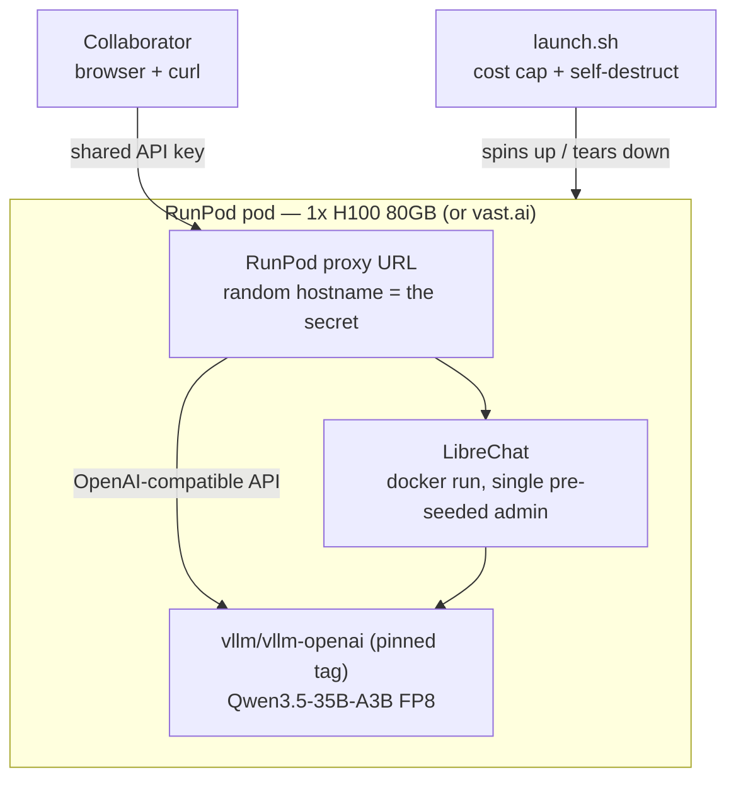
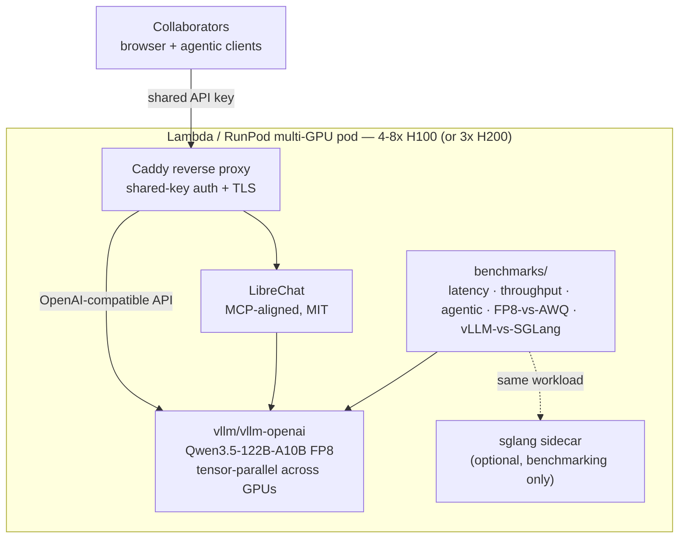
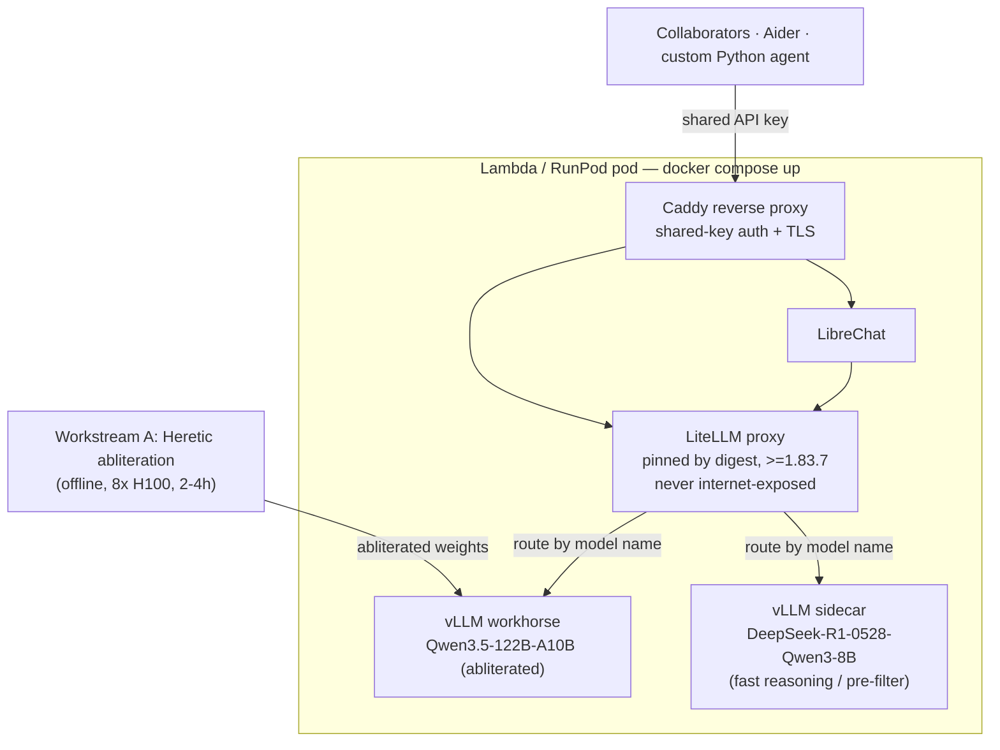
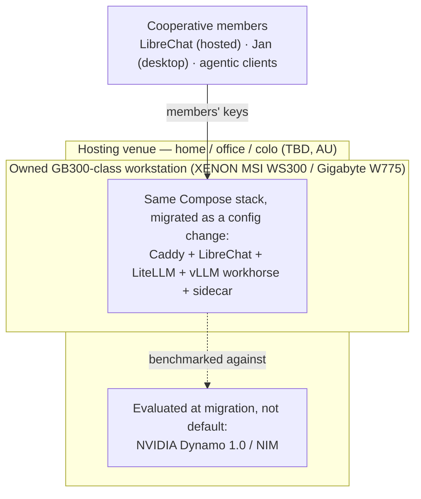

# Plan: Sovereign-LLM Audition

> **SOV Outlasts Vendors.**

This document describes the engineering plan for the SOV repo: how we get from "no infrastructure" to "the cooperative has tried the experience on rented GPUs and decided whether to buy hardware."

It is the live plan. Revise it in place when reality diverges; mark superseded sections rather than deleting them so we keep an audit trail.

**Reading order:** [rationale](docs/rationale/) → this plan → individual [phase docs](phases-cloud/) as they're created.

---

## 0. TL;DR

We're auditioning a sovereign-LLM software stack on rented cloud GPUs across four phases:

| Phase | Goal | Hardware | Headline cost | Duration |
|---|---|---|---|---|
| **0** | Validate the stack end-to-end with a small model | 1× H100 (RunPod / vast.ai) | ~$50–$150 AUD | 1–3 days of active work |
| **1** | Run the full target model under realistic load | 4–8× H100 (Lambda or RunPod) | ~$500–$1,500 AUD | 1–2 weeks |
| **2** | De-censor + agentic POC + heterogeneous routing | Same as phase 1 plus 1× H100 sidecar | ~$1,000–$2,500 AUD | 2–3 weeks |
| **3** | Physical DGX Station migration | GB300-class workstation (MSI WS300 / Gigabyte W775 via XENON; NVIDIA-branded DGX Station not shipping to AU as of May 2026) | ~$130k–$170k AUD one-time | TBD; gated on cooperative formation |

The audition through end of phase 2 is **~$1,500–$4,000 AUD** total. That is the budget that lets the three of us decide whether the hardware purchase is worth pitching to a wider group.

---

## 1. Scope and non-goals

### In scope
- A reproducible cloud-GPU stack that mirrors what would later run on a DGX Station.
- Launch scripts with hard runtime caps and printable URLs for ephemeral collaborator access.
- Side-by-side benchmarks of vLLM and SGLang on representative agentic workloads.
- A documented de-censoring procedure (abliteration only — DPO is out of scope until there's actual demand).
- An agentic proof-of-concept workflow runnable by any collaborator.
- A path-to-production architecture for the eventual physical DGX Station, written but not built.

### Out of scope (at this stage)
- Real user accounts or production-grade auth. Audition runs use ephemeral pod URLs + a shared API key.
- Kubernetes, Ansible, NixOS, or any orchestration with a learning curve. Bash + Docker Compose is the floor and the ceiling.
- DPO / SFT fine-tuning beyond the basic abliteration step. Cost and complexity don't pay off until there's a committed cooperative.
- Public-facing recruitment material. We summarise for laypeople once the audition is complete.
- Australian-hosted GPU rental. The AU GPU landscape has grown in 2025–2026 (SHARON AI, ResetData AI-F1, Micron21, NEXTDC colo, hyperscalers), but on-demand hourly pricing still runs ~30–60% above US-region equivalents and most AU offers are bare-metal/monthly leases rather than minute-billed pods — a poor fit for our ephemeral-audition model. We accept the US-cloud audition for the prototype and surface the tension in the eventual cooperative pitch.
- Multi-region failover, observability platforms beyond a `docker logs`, or any "production hardening" that doesn't earn its keep at three users.

### Non-goal: matching commercial models
The rationale document is explicit about this: a self-hosted open-weight model is *not* trying to beat Claude or GPT-5. It's trying to be good enough that we'd be glad to have it if the commercial options went away. Don't optimise for benchmark scores against frontier models; optimise for "the audition feels like a usable working environment."

---

## 2. Architecture decisions (recap)

Full ADRs are in [`docs/decisions/`](docs/decisions/). One-line summaries:

| Choice | Decision | Why |
|---|---|---|
| Audition cloud | RunPod primary; vast.ai for cheap phase-0; Lambda for phase-1 scale | Familiarity, fast spin-up, ephemeral URLs built in. Vast.ai is cheaper but has trust caveats. |
| Inference engine | vLLM primary; SGLang benchmarked at phase 1; Dynamo + NIM documented for DGX migration | vLLM has the broadest ecosystem (Aider, Claude Code, LangChain) and first-class GB300/DGX Station support. SGLang's 2026 numbers may flip this at phase-1 benchmark; see ADR 0002. |
| User-facing surface | OpenAI-compatible endpoint + LibreChat; Jan as recommended desktop client | OpenAI compat is the universal interface; LibreChat is MIT, MCP-aligned, supports conversation forking. Revised from Open WebUI on 2026-05-12 — see ADR 0003 §Revision. |
| Auth (audition) | Ephemeral pod URLs + shared API key + runtime cap | Cost-bounded blast radius even if URL leaks. |
| Orchestration | `docker run` at phase 0; Docker Compose from phase 1 | Compose is the floor for multi-service. Heterogeneous routing via LiteLLM proxy (pinned ≥1.83.7, never internet-exposed — see phase 2). |
| Models | Qwen3.5-35B-A3B → Qwen3.5-122B-A10B (FP8) → de-censored + reasoning sidecar → DGX | Each phase exercises more of the stack at higher cost; can stop at any phase. DeepSeek V4-Flash enters the phase-1 bake-off; its sparse attention reshapes the concurrency maths — see [ADR 0007](docs/decisions/0007-deepseek-v4-and-the-concurrency-consequence.md). |
| Decensoring | Abliteration only at this stage; DPO deferred | Abliteration is ~$50–$100 USD; DPO is $1.5–4k AUD and only earns its keep with a committed cooperative. |

---

## 3. Phased roadmap

Each phase has its own directory under [`phases-cloud/phase-N-name/`](phases-cloud/) with a `README.md`, scripts, and an exit-criteria checklist. The phase directory is created when the phase begins, not before.

### High-level dependency graph

```
phase 0 (stack validation)
   |
   v
phase 1 (full audition)        --> ADR: keep/swap engine
   |
   v
phase 2 (decensor + agentic + routing)
   |
   v
phase 3 (DGX migration)        --> gated on cooperative legal formation
```

Phases must be done in order; nothing in phase 1 should require revisiting phase-0 decisions, and so on.

### Parallel tracks

Some work doesn't fit the cloud-audition phase numbering but is still under SOV's umbrella because it shares interface conventions:

- [**`phases-apple/`**](phases-apple/) — Mac-native personal stack on Apple Silicon, mirroring the audition's OpenAI-compatible + LiteLLM interface choices but with mlx-lm and Ollama as backends. Daily use of the laptop track is practice for the cloud audition. Rationale: [ADR 0004](docs/decisions/0004-apple-laptop-personal-track.md); position on Apple Neural Engine: [ADR 0005](docs/decisions/0005-apple-neural-engine.md). The laptop track has its own internal sub-phases (`phase-0` through `phase-4`) which are independent of the audition phases.

---

## 4. Phase 0 — stack validation

**Goal:** prove the full stack runs end-to-end on a single GPU with a small model. We are not testing model quality here; we are testing that we can spin up a pod, serve an OpenAI-compatible API, hit it from LibreChat, hit it from a collaborator's machine, and tear it down with a printable cost.



Two bare `docker run` containers, no Compose yet — the whole point of phase 0 is that this minimal shape works before we add services.

### Hardware

- **Primary:** 1× H100 80GB on **RunPod**. ~$2.40–$3.00 USD/hour (PCIe to SXM) as of May 2026.
- **Alternative for cost-conscious experimentation:** 1× H100 or RTX 6000 Ada on **vast.ai**, typically 30–50% cheaper. **Caveat:** vast.ai hosts have root on the physical machine. Use only with public open-weight models and synthetic test prompts; do not feed it anything sensitive. ADR in [`docs/decisions/0001-cloud-providers.md`](docs/decisions/0001-cloud-providers.md) covers the trade-off in detail.

### Model

- **[Qwen3.5-35B-A3B](https://huggingface.co/Qwen/Qwen3.5-35B-A3B)** (MoE, 3 B active; thinking-by-default; matches the apple-track `local-small`) — small enough to fit on one H100 with room for a healthy KV cache. Serve FP8 (Qwen ships a first-party FP8 build) on H100, or 4-bit AWQ if you want headroom for KV cache.
- This is *not* the audition model. It's the stack-validation model. Do not draw quality conclusions from it.

### Software stack

```
RunPod pod
  |--> docker run vllm/vllm-openai:v0.20.2 serving Qwen3.5-35B-A3B
  |--> docker run librechat pointed at vLLM (no-registration mode, single pre-seeded admin)
  '--> RunPod proxy URL exposed on a unique random hostname
```

(Pin a specific `vllm/vllm-openai` tag — `:latest` is forbidden by §10. Pick the current vLLM release at phase-0 launch and pin it.)

No Docker Compose at this phase. Two `docker run` commands and a launch script that orchestrates them is enough.

### Deliverables

When phase 0 is "done", the repo contains:

- [`phases-cloud/phase-0-stack-validation/README.md`](phases-cloud/) — runbook
- [`phases-cloud/phase-0-stack-validation/launch.sh`](phases-cloud/) — script that:
  - takes a `--max-runtime-hours N` flag with a default of 4 and a hard cap of 24
  - spins up a RunPod pod (via `runpodctl` or the API)
  - waits for vLLM and LibreChat to be ready
  - prints the access URL and the shared API key
  - prints the destruction command
  - schedules its own self-destruct at the runtime cap
- [`phases-cloud/phase-0-stack-validation/teardown.sh`](phases-cloud/) — explicit destroy command
- A short ADR in [`docs/decisions/`](docs/decisions/) recording any discoveries that reshape later phases (e.g., RunPod startup-time gotchas)

### Exit criteria

A collaborator who has never seen the repo can:
1. Clone it
2. Set their RunPod API key in `.env`
3. Run `./phases-cloud/phase-0-stack-validation/launch.sh`
4. Open the printed URL in their browser
5. Have a conversation with Qwen3.5-35B-A3B in LibreChat
6. Hit the OpenAI-compatible endpoint from `curl` with the printed API key
7. Walk away and have it auto-destroy at the runtime cap

…all within 30 minutes of starting and for under $15 AUD.

### Budget

| Item | Cost |
|---|---|
| RunPod 1× H100, 4-hour test session | ~$10–$15 USD (~$15–$23 AUD) |
| Vast.ai equivalent | ~$5–$8 USD |
| Phase 0 total (across multiple test sessions during development) | **~$50–$150 AUD** |

### Open questions for phase 0

- Are we OK shipping a single shared API key per pod, or do we want one-key-per-collaborator from day 0? (Default: shared. Re-evaluate at phase 2.)
- RunPod's built-in proxy URL vs. a Cloudflare Tunnel for portability across clouds? (Default: RunPod's. Cloudflare Tunnel becomes interesting at phase 1 when we may use Lambda.)

---

## 5. Phase 1 — full audition

**Goal:** run the actual target model under realistic load and produce the data needed to decide whether the hardware purchase makes sense.



`docker compose up` orchestrates everything from this phase onward — the Compose file is the contract for what services exist.

### Hardware

- **Primary:** 4–8× H100 80GB on **Lambda** (lambda.ai — formerly lambdalabs.com) or **RunPod**.
- 4× H100 = 320 GB HBM. Qwen3.5-122B-A10B at FP8 is ~122 GB; at AWQ 4-bit ~65 GB. Either fits 4× H100 with generous KV-cache headroom; 8× H100 only if SGLang side-by-side benchmarking and concurrent agentic sessions demand it (memory is no longer the binding constraint at the smaller-model successor).
- **H200 path:** 3× H200 80→141 GB HBM3e is now a viable alternative, shrinking the phase-1 minimum spend ~25%. Cost per GPU is similar to H100 (~$4 USD/hr on RunPod) but you need fewer of them. B200 is on the menu but unnecessary at our scale through phase 2.

### Model

- **[Qwen3.5-122B-A10B](https://huggingface.co/Qwen/Qwen3.5-122B-A10B)**, served as **FP8** ([Qwen/Qwen3.5-122B-A10B-FP8](https://huggingface.co/Qwen/Qwen3.5-122B-A10B-FP8)) on H100/H200, with AWQ 4-bit ([cyankiwi/Qwen3.5-122B-A10B-AWQ-4bit](https://huggingface.co/cyankiwi/Qwen3.5-122B-A10B-AWQ-4bit)) as the smaller-footprint fallback.
- Why FP8 not AWQ as default: as of 2026, FP8 (W8A8) is vLLM's recommended quantization on Hopper — hardware-accelerated, ~2× memory reduction, up to 1.6× throughput, near-BF16 quality. AWQ wins on accuracy at INT4 and remains the right choice when memory is genuinely tight (or for vRAM-constrained sidecars), but the cost/quality trade-off has tilted toward FP8.
- Why Qwen3.5-122B-A10B not Qwen3-235B: same audition aim, smaller and newer model, comparable quality on public benchmarks, fits 3× H200 or 4× H100 with room to spare. Qwen3.5-397B-A17B is the new flagship but overkill for 3 collaborators and lacks community AWQ ports.

### Software stack

```
Lambda or RunPod multi-GPU pod
  '--> docker compose up
        |--> vllm/vllm-openai (Qwen3.5-122B-A10B FP8, tensor-parallel across 4-8 GPUs)
        |--> librechat (pointed at vLLM, MCP-aligned, MIT)
        |--> Caddy reverse proxy w/ shared-key auth (nginx acceptable; Caddy
        |    preferred for ~10-line config + automatic TLS when off RunPod proxy)
        '--> [optional] sglang sidecar for benchmarking
```

Docker Compose from this phase onward. The Compose file is the source of truth for what services exist; the launch script just wraps `docker compose up` plus pod orchestration.

### Benchmarks

This is the phase where we generate the evidence for or against the hardware purchase. Benchmarks must include:

1. **Single-stream latency** (TTFT and tokens/sec) at three context lengths: 2k, 16k, 64k.
2. **Concurrent throughput** with 3, 8, and 16 simulated users running representative workloads.
3. **Agentic round-trip** — measure the full latency of one tool-calling cycle (prompt → tool call → tool result → response) on at least one realistic agentic task.
4. **vLLM vs. SGLang** side-by-side on the same workload. Break results down by workload class — unique-prompt vs. prefix-heavy/multi-turn — since SGLang's RadixAttention advantage is workload-dependent. The 2026 public numbers say the gap is large on the workloads we care about (multi-turn agentic, DeepSeek-class sidecar models); a flat ">15% threshold" is no longer the right framing. See [ADR 0002](docs/decisions/0002-inference-engine.md) for the revised re-evaluation criteria.
5. **FP8 vs AWQ 4-bit** side-by-side on the same model, with throughput and accuracy on a held-out task suite. This is the live quantization trade-off in 2026 — record the answer for SOV's workload, not just the general claim.
6. **DeepSeek V4-Flash vs Qwen3.5-122B-A10B** as a workhorse arm. The interesting axis is concurrency under long contexts: V4's sparse attention changes the KV-cache budget by roughly an order of magnitude — measure it against the worked arithmetic in [ADR 0007](docs/decisions/0007-deepseek-v4-and-the-concurrency-consequence.md) and replace the illustrative numbers there with the real ones.

Output: a `phases-cloud/phase-1-full-audition/benchmarks.md` with results, raw data, and a recommendation.

### Deliverables

- [`phases-cloud/phase-1-full-audition/README.md`](phases-cloud/) — runbook
- [`phases-cloud/phase-1-full-audition/docker-compose.yml`](phases-cloud/) — service definitions
- [`phases-cloud/phase-1-full-audition/launch.sh`](phases-cloud/) — multi-GPU pod orchestration with cap
- [`phases-cloud/phase-1-full-audition/teardown.sh`](phases-cloud/)
- [`phases-cloud/phase-1-full-audition/benchmarks/`](phases-cloud/) — scripts that run the benchmarks above and write reproducible results
- [`phases-cloud/phase-1-full-audition/benchmarks.md`](phases-cloud/) — written-up findings
- One ADR in [`docs/decisions/`](docs/decisions/) recording vLLM-vs-SGLang outcome

### Exit criteria

1. The three collaborators have each had at least one extended (60+ minute) work session against the audition stack and written up subjective impressions in `phases-cloud/phase-1-full-audition/impressions.md`.
2. Throughput numbers from the benchmark suite are within ±25% of the [technical rationale's predictions](https://danmackinlay.name/notebook/aus_sovereign_llm_technical.html) — discrepancies investigated and explained.
3. We have a written go/no-go recommendation on phase 2.

### Budget

| Item | Cost |
|---|---|
| 8× H100 on Lambda @ ~$32 USD/hr × 30 hrs of active testing | ~$960 USD |
| RunPod or vast.ai equivalents for ad-hoc work between sessions | ~$200 USD |
| Phase 1 total | **~$1,200–$1,800 AUD** |

If we restrict to 4× H100 (or 3× H200) and tight session discipline, this drops by ~40%.

---

## 6. Phase 2 — decensor + agentic POC + heterogeneous routing

**Goal:** show the cooperative what life with sovereign compute would actually feel like — a model that doesn't refuse on Tiananmen, an agent that does real work, and a routing layer that lets us mix small and large models.

This phase has three independent workstreams that can run in parallel.



Workstream A produces the weights; Workstream B is the agentic clients on the left; Workstream C is the LiteLLM routing layer. The workhorse + sidecar split is the DGX pattern rehearsal — see [ADR 0007](docs/decisions/0007-deepseek-v4-and-the-concurrency-consequence.md) for the V4-Flash contingency.

### Workstream A: Abliteration

Apply abliteration to Qwen3.5-122B-A10B using **[Heretic](https://github.com/p-e-w/heretic)** (actively maintained as of May 2026, explicit Qwen3.5 support, 3000+ community-produced models). [llm-abliteration](https://github.com/jim-plus/llm-abliteration) is the older-architecture fallback (tested through Qwen2.5/Mistral-Nemo/Gemma-3; no documented Qwen3.5 coverage). Run on rented 8× H100 for 2–4 hours.

**Architecture-lag risk if the phase-1 bake-off picks V4-Flash instead of Qwen3.5-122B-A10B** (see [ADR 0007](docs/decisions/0007-deepseek-v4-and-the-concurrency-consequence.md)): Heretic does *not* yet have mature V4-Flash support (issue #310 open and unresolved as of May 2026); the only community-abliterated V4-Flash is GGUF-for-llama.cpp, so this workstream would still need to produce a vLLM-servable FP8 abliterated build itself. Do not assume Qwen-level abliteration maturity for V4. The abliteration target is settled by the phase-1 model recommendation; this workstream's risk profile changes materially depending on which way that lands.

**Deliverables:**
- [`phases-cloud/phase-2-decensor-agentic/abliteration/run.sh`](phases-cloud/) — automated pipeline
- Pre-and-post evaluation against the [Shisa.AI Qwen2 censorship taxonomy](https://shisa.ai/posts/qwen2-chinese-llm-censorship-analysis/) in both English and Chinese, results checked into the repo
- The abliterated weights themselves stored on… [open question — see §9]

**Cost:** ~$50–$100 USD compute + iteration time.

### Workstream B: Agentic proof-of-concept

A runnable demo where each collaborator can experience an agent doing real-ish work against the sovereign endpoint.

**Candidate POCs** (we pick one or two; do not build all):

1. **Aider** pointed at the SOV endpoint, doing a small refactor on a sample repo. Lowest implementation cost; immediate signal on coding-agent feel.
2. **Claude Code in API mode** with `ANTHROPIC_BASE_URL` redirected to the SOV endpoint via an OpenAI-to-Anthropic translation shim. Highest "wow factor" if it works; significant integration cost (Claude Code expects Anthropic-format API). **If V4-Flash is the served model, the shim may be unnecessary** — V4 ships a native Anthropic-format API ([ADR 0007](docs/decisions/0007-deepseek-v4-and-the-concurrency-consequence.md), and §9 open question 2), which would collapse this candidate's main integration cost. Confirm empirically before building the shim.
3. **A small custom Python agent** that does something concrete: read a CSV, do a multi-step research task, write a report. Maximum control; least transferable.

**Default:** Aider as the workhorse POC plus a 50-line custom Python agent that exercises tool calling end-to-end. Claude-Code-in-API-mode is a stretch goal.

**Deliverables:**
- [`phases-cloud/phase-2-decensor-agentic/agentic/`](phases-cloud/) — runnable demos and a written walkthrough
- A note on what worked, what frustrated, and how it compares to Claude Code against Anthropic's actual API (the realistic baseline)

**Cost:** development time + a few hours of GPU time for testing.

### Workstream C: Heterogeneous routing

Add a [LiteLLM](https://github.com/BerriAI/litellm) proxy in front of the inference layer. Wire two backends:

1. **Qwen3.5-122B-A10B (abliterated)** — the workhorse.
2. **[DeepSeek-R1-0528-Qwen3-8B](https://huggingface.co/deepseek-ai/DeepSeek-R1-0528-Qwen3-8B)** — fast/cheap "sanity-check" or "pre-filter" thinking model. The 8B distill ties Qwen3-235B-Thinking on AIME-2024, runs on a fractional H100, and is the current sweet spot for the small-reasoning slot. (We can swap to a Qwen3.5 thinking variant once an mlx-compatible port lands, for parity with the apple-track `local-math`.)

LiteLLM presents a single OpenAI-compatible endpoint. Clients pick a model by name; LiteLLM routes to the right backend.

**Contingency if V4-Flash is the workhorse** (see [ADR 0007](docs/decisions/0007-deepseek-v4-and-the-concurrency-consequence.md) decision 4): V4-Flash's multi-tier thinking modes (Non-think / Think-High / Think-Max) may collapse the workhorse-vs-reasoning-sidecar split — a single model covers both roles. Do **not** drop to a one-backend setup if that happens; repurpose the second slot to a cheap classifier/pre-filter instead. The two-backend demo is the DGX workhorse+sidecar-pattern rehearsal and is worth keeping regardless of whether the second model is a reasoner or a classifier.

This sets up the architecture pattern we'd want on the eventual DGX setup: workhorse + sidecar(s).

**Deliverables:**
- Updated [`docker-compose.yml`](phases-cloud/) including LiteLLM and the second model server
- [`phases-cloud/phase-2-decensor-agentic/routing/litellm-config.yaml`](phases-cloud/)
- A short runbook documenting how to add a third backend
- LiteLLM container **pinned by digest to a version ≥1.83.7** (CVE-2026-42208 pre-auth SQL injection fixed in 1.83.7; a March 2026 PyPI supply-chain attack pushed malicious 1.82.7/1.82.8 — pin by digest, not by tag). LiteLLM is **never exposed directly to the internet** — always behind the Caddy reverse proxy from §5.

**Cost:** ~1× extra H100-hour per testing session; mostly absorbed in workstream A and B's GPU time.

### Phase 2 exit criteria

1. Abliterated weights pass a documented evaluation showing dramatic refusal-rate reduction without obvious quality regression on a held-out task suite.
2. At least one collaborator has used the agentic POC for a non-trivial real task and written up the experience.
3. LiteLLM routing demonstrably switches between workhorse and sidecar based on model name, with at least one documented use case where the sidecar is genuinely useful (e.g., quick classification before invoking the big model).

### Budget

**~$1,000–$2,500 AUD** total. Abliteration is cheap; the routing setup is just config. Most cost is repeated audition sessions while iterating on the agentic POC.

---

## 7. Phase 3 — physical DGX Station migration (outline only)

This is gated on:
- Cooperative legal formation (incorporated association, see [legal section in the rationale](https://danmackinlay.name/notebook/aus_sovereign_llm_technical.html#legal-coop)).
- Sufficient member commitment to fund the purchase.
- A go-recommendation from phases 1 and 2.



The whole point of standardising on vLLM + Docker Compose is that the cloud-to-owned-hardware move is a config change, not a rewrite. **At a high level**, this phase will:

1. Place the order through an Australian NVIDIA partner. As of May 2026, NVIDIA-branded DGX Station is **not shipping to AU** — [XENON](https://xenon.com.au) sells the GB300-equivalent OEM workstations (MSI WS300 ~AU$130k, Gigabyte W775) instead. Dell and MMT have similar OEM channels. Lead time: months.
2. Pick the hosting venue: home, shared office, or colo. The rationale doc has a full discussion; the network reliability section will drive the call.
3. Migrate the phase-2 stack to the DGX. The whole point of standardising on vLLM + Docker Compose is that this should be a config change, not a rewrite. **vLLM now has first-class GB300/DGX Station support** (added in the GTC 2026 timeframe), so the migration is plausible without leaving the audition stack at all. The rationale document mentions NIM as the smoothest migration target; the May-2026 landscape also offers **[NVIDIA Dynamo 1.0](https://github.com/ai-dynamo/dynamo)**, an open-source distributed inference stack that integrates with vLLM/SGLang/llm-d and is less locked-in than NIM. We will evaluate Dynamo and NIM at the time but expect to stay on vLLM.
4. Burn-in and member onboarding.

**We will write phase 3 in detail when we are within ~3 months of placing an order.** Everything before that is speculative.

---

## 8. Cross-cutting concerns

These apply to every phase.

### Cost discipline

- Every launch script enforces `--max-runtime-hours` with a hard ceiling of 24 hours.
- Every launch script prints, on startup: the runtime cap, the projected cost at cap, and the destruction command.
- The teardown script is idempotent (running it twice is fine) and verifies the resource is actually gone before exiting 0.
- We log every audition session in [`docs/sessions.md`](docs/) with date, duration, cost, and what was learned.

### Security posture

- Shared API keys live in `.env`, which is gitignored. Never commit a key.
- vast.ai is treated as untrusted; we don't process anything sensitive on it.
- The shared key + ephemeral URL approach assumes the URL itself is the secret. Don't post URLs in public channels or screenshots while a session is live.
- Auto-destruction caps blast radius if a key or URL leaks.

### Observability

- `docker logs <service>` and the vLLM `/metrics` endpoint are sufficient at the audition scale.
- We write a minimum-viable structured log of each session to [`docs/sessions.md`](docs/) for institutional memory.
- Real observability infrastructure (Grafana, Prometheus stacks) is out of scope until phase 3.

### Reproducibility

- Every script pins versions: vLLM image tag, model revision, RunPod pod template ID. No `:latest` tags except where explicitly marked "track upstream". LiteLLM (phase 2) is pinned **by digest** rather than by tag — see CVE-2026-42208 and the March 2026 PyPI supply-chain compromise for why.
- **If V4-Flash is served, vLLM is pinned to a known-good *commit*, not just a release tag.** Multiple May-2026 reports of V4 working then breaking across vLLM commits (NVIDIA dev forum); a release tag is too coarse for the `deepseek_v4` path. This sharpens the rule above for that one model; it is not a separate policy. See [ADR 0007](docs/decisions/0007-deepseek-v4-and-the-concurrency-consequence.md) §Consequences.
- The Compose file is the contract; updating it requires updating the phase doc that references it.

---

## 9. Open questions and deferred decisions

These are real questions we have not yet answered. Record the resolution here when we make a call.

1. **Where do we store the abliterated weights?** Options: HuggingFace private repo, an S3-equivalent bucket, or just regenerate from the script each time. Cost vs. convenience trade-off. Resolve before phase 2.
2. **Does Claude Code's API mode work via an OpenAI-to-Anthropic shim?** Investigate before phase 2 workstream B; it would be a high-impact demo if so. DeepSeek V4 ships a native Anthropic API, which may remove the need for a shim entirely — see [ADR 0007](docs/decisions/0007-deepseek-v4-and-the-concurrency-consequence.md).
3. **Is the Australian-cloud-purity tension worth surfacing in the audition itself, or only in the eventual recruitment doc?** Default: surface in [`docs/decisions/0001-cloud-providers.md`](docs/decisions/) and let it inform the recruitment narrative; don't change audition behaviour.
4. **What's the right license for this repo?** Probably MIT or Apache-2.0 to encourage forking by other collectives. Resolve before going public.
5. **Phase 3 hosting venue (home / office / colo).** Defer until phase 2 results inform reliability requirements.
6. **NIM evaluation depth at phase 3.** We've decided not to use it as the audition path, but we should at minimum verify it (and now Dynamo 1.0) can serve the same weights when we get to physical hardware. Defer.
7. ~~**When do we swap Open WebUI for LibreChat?**~~ **Resolved 2026-05-12:** LibreChat adopted as primary from day 1 (was: pre-commit at phase 3 if membership >50). See [ADR 0003 §Revision](docs/decisions/0003-audition-surface-and-auth.md#revision-2026-05-12--librechat-promoted-to-primary).

---

## 10. Repo layout

```
SOV/
  README.md                  short repo overview
  CLAUDE.md                  shared agent context
  PLAN.md                    this document
  .gitignore
  docs/
    rationale/               read-only mirrors of the case-for-this-work posts
    decisions/               ADRs (architectural decision records)
    context/                 supplementary context for collaborators and agents
    sessions.md              log of every audition session (created at phase 0)
  phases-cloud/                cloud-audition track (the main SOV arc)
    phase-0-stack-validation/  created when phase 0 begins
    phase-1-full-audition/     created when phase 1 begins
    phase-2-decensor-agentic/  created when phase 2 begins
    phase-3-dgx-migration/     created when phase 3 is real
  phases-apple/                parallel track: Mac-native personal stack
    phase-0/                   mlx-lm + Jan baseline
    bin/                       model-switch.sh, model-status.sh
  scripts/
    common/                    shared bash helpers used across tracks
```

A phase directory always contains:

- `README.md` — runbook for the phase
- `launch.sh` — entry point for spinning up the audition
- `teardown.sh` — explicit destroy
- Whatever phase-specific assets the workstreams require (Compose files, benchmark scripts, model configs)

---

## 11. What happens next

Immediate next step is to **scope phase 0 in detail with Dan**: confirm RunPod account credentials and quotas, decide on `runpodctl` vs. raw API, settle the LibreChat vs. raw API surface for the first session, and write the launch script. That conversation produces the contents of [`phases-cloud/phase-0-stack-validation/`](phases-cloud/) and triggers the first auditioned run.

After phase 0 ships, we recap what we learned, update this plan if anything changed, and scope phase 1 the same way.

---

**Last freshness audit:** 2026-05-12. Provider pricing, model picks, quantization defaults, and inference-engine landscape (vLLM/SGLang/Dynamo) verified against upstream sources. Re-audit before each phase begins; staleness compounds.
