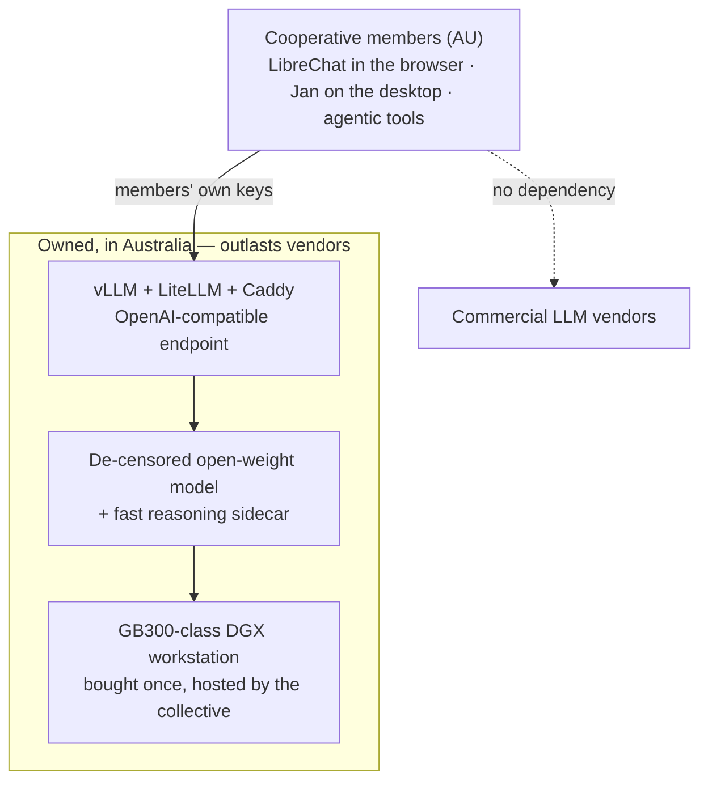

# SOV

> **SOV Outlasts Vendors.**

Prototype work for an Australian sovereign-LLM cooperative — a "try before you buy" audition of the software stack that would eventually run on owned hardware.

We're building in the open.
The initial collaborators are scoping it; the repo is public so other groups at similar scales thinking about the same problem can find us, fork freely, and (eventually) run their own audition.
We welcome collaborations; feel free to fork/contribute.
We don't promise to reply yet.

This repo will be most LLM-agent built; we are rapidly auditioning technology here for now and drilling down later.

## End goal

If the audition succeeds, the target is a small Australian collective that owns a DGX-class workstation, runs a de-censored open-weight model on it, and serves inference to its members — with no commercial vendor in the dependency chain. The diagram below sketches that target.
The audition exists to test whether it is worth building.

## Where to start

0. **Interested? [Sign up for updates](https://woozy-page-39c.notion.site/32d398af2ab0805293a9dfb1561b4bdf?pvs=105).**
1. **Why we're doing this** — read the rationale, two posts on Dan's blog:
   - The [institutional/geopolitical case](https://danmackinlay.name/notebook/aus_sovereign_llm.html)
   - The [technical sktch](https://danmackinlay.name/notebook/aus_sovereign_llm_technical.html) (which we hope to be superceded by this)
   - See [`docs/rationale/`](docs/rationale/) for the executive summary.

2. **What we're building** — read [`PLAN.md`](PLAN.md). That's the live plan, the architecture decisions, and the phased roadmap.

3. **How we collaborate with Claude Code** — see [`CLAUDE.md`](CLAUDE.md) for shared agent context. Anyone running Claude Code in this repo will get this loaded automatically.

## Status

See [`PLAN.md`](PLAN.md) for the current phase, exit criteria, and what we're working on next.

## Contributing

We're an early, small-collective project.
Note that we may not be able to review PRs on any fixed time horizon; this is a spare-time projct.

What's welcome:

- **Issues** flagging factual errors in [`PLAN.md`](PLAN.md) or the [ADRs](docs/decisions/) — we'd rather know.
- **Forks** by other groups thinking about sovereign compute. The Apache-2.0 [`LICENSE`](LICENSE) is permissive; replication is a stated goal of the project. If you fork to start your own collective, [say hi](https://danmackinlay.name/contact.html).
- [**Contact** if you're interested in the cooperative itself](https://woozy-page-39c.notion.site/32d398af2ab0805293a9dfb1561b4bdf?pvs=105) (tick the “sovereign compute” box)

## Non goals (for us)

* Compliance to regulations in any jurisdiction other than our own (Australia).
* tech stacks infeasible for our time- and compute- budget

## What goes in this repo

Documented in [`docs/context/public-repo-policy.md`](docs/context/public-repo-policy.md).
